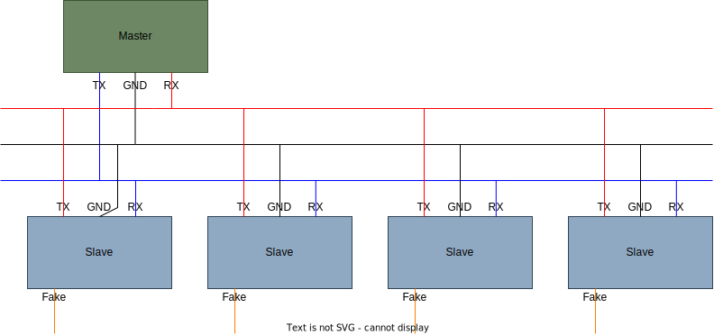

Библиотека для объединения микроконтроллеров в единую сеть с общей шиной при помощи интерфейса UART (SoftwareSerial).

В конструкторе необходимо настроить нужный размер буффера, так как библиотека пока что не защищена от его переполнения.

Преимущества:
+ Возможность динамической адресации (по сравнению с i2c или spi). Во время выполнения, мк имеет возможность поменять свой адрес.
    > Каждому отправляемому сообщению можно назначить адрес, либо отправить сообщение для всех (широковещательная рассылка)
+ Высокая скорость передачи данных по сравнению с другими топологиями сети, например кольцевая шина
+ Высокая надежность
    > Встроенная проверка crc при получении сообщения, а также возможность отправлять сообщения, на которые получатель обязательно должен ответить

Ограничения работы:
+ В системе может быть только один мастер. (Но можно адаптировать под нескольких)
+ Все платы slave слышат только мастера, и общаются только с мастером. Они не видят друг друга.
+ Мастер слышит всех и вещает всем.
+ Нельзя допускать, чтобы одновременно более 1 slave говорили что-то мастеру. (это должно контролироваться мастером, например, выдавать квант каждому slave поочереди ИЛИ slave имеет право голоса только если его спросили)

Схема соединения следующая:

> Fake - любой незанятый цифровой пин. Используется библиотекой для работы с Serial.

Гибкая настройка буффера:
+ Задать размер __максимального размера сообщения__ можно прямо в конструкторе класса библиотеки (SerialBusMaster или SerialBusSlave). Имя параметра - _bufferSize_
+ Задать __размер очереди поступаемых сообщений__ - это настраивается через определение директивы препроцессора для библиотеки SoftwareSerial. (Подробнее тут: https://forum.arduino.cc/t/increasing-arduino-serial-buffer-size/322151/19)
    > Вкратце: перед подключением заголовочных файлов SerialBus и SoftwareSerial определить нужную директиву из этих двух (либо две сразу):
    _#define SERIAL_TX_BUFFER_SIZE 128_
    _#define SERIAL_RX_BUFFER_SIZE 128_